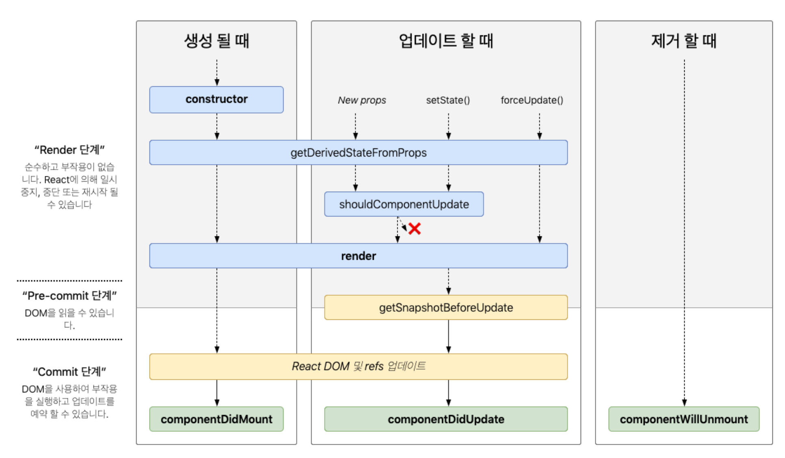

<!-- header 영역 -->
<p align="center">
 
 <h2 align="center">201930324 이현종</h2>
 <p align="center">📖 웹 애플리케이션 전공</p>
</p>

<h3 align="center">📚 Tech Stack 📚</h3>
<p align="center">
  </a>&nbsp 
  </a>&nbsp
  </a>&nbsp
  </a>&nbsp
  </a></br>
  </a>&nbsp
  </a>&nbsp
  </a><br/>
  <a href="https://github.com/soaple/first-met-react-practice-v18">
  
  </a>
</p>

[](https://www.acmicpc.net/user/guswhd284)

<!-- main 영역 -->

## 강의 목록
1. [9주차](#9주차)➡️
2. [7주차](#7주차)➡️
3. [6주차](#6주차)➡️
4. [5주차](#5주차)➡️
5. [4주차](#4주차)➡️
6. [3주차](#3주차)➡️
7. [2주차](#2주차)➡️
8. [1주차](#1주차)➡️

---

## 7주차

* 04/27

<details><summary>📖 이벤트 핸들링 </summary>

  <details><summary>📚 이벤트란? </summary>

  * 사용자가 버튼을 클릭하는 등의 사건을 의미
  * DOM에서는 클릭 이벤트를 처리할 함수를 onclick을 통해서 전달합니다.

  </details>

  <details><summary>📚 이벤트 처리하기 </summary>

    <details><summary>📘 DOM의 이벤트 </summary>

    * 이벤트의 이름을 모두 소문자로 표기
    * 이벤트를 처리할 함수를 문자열로 전달
    
    </details>

    <details><summary>📘 리액트의 이벤트 </summary>

    * 이벤트의 이름을 카멜 표기법으로 표기
    * 이벤트를 처리할 함수를 그대로 전달
    
    </details>

    <details><summary>📘 둘의 차이점 </summary>

    * 이벤트 이름이 onclick 에서 onClick으로 변경(Camel case)
    * 전달하려는 함수는 문자열에서 함수 그대로 전달
    
    </details>

    <details><summary>📘 이벤트 핸들러 </summary>

    * 이벤트가 발생했을 때 해당 이벤트를 처리하는 함수
    * 이벤트 리스너 라고 부르기도 함

      <details><summary>📘 이벤트 핸들러 코드 </summary>
      ```jsx
      
      import React from "react";

      class Toggle extends React.Component{
          constructor(props){
              super(props);

              this.state = { isToggleOn : true };

              this.handleClick = this.handleClick.bind(this);
          }

          handleClick(){
              this.setState(prevState = ({
                  isToggleOn: !prevState.isToggleOn
              }));
          }

          render(){
              return(
                  <button onClick={this.handleClick}>
                      {this.state.isToggleOn ? '켜짐' : '꺼짐'}
                  </button>
              );
          }
      }
      ```
      </details>

      <details><summary>📘 클래스 컴포넌트 </summary>

      * 클래스의 함수로 정의하고 생성자에서 바인딩해서 사용
      * 클래스 필드 문법도 사용가능
      
      </details>

      <details><summary>📘 함수 컴포넌트 </summary>

      * 함수 안에 함수로 정의하거나 arrow function을 사용하여 정의
      
      </details>
    
    </details>

  </details>

</details>

---

## 7주차

* 04/13

<details><summary>📖 hook </summary>

* 원래 존재하는 어떤 기능에 마치 갈고리를 거는 것처럼 끼어 들어가 같이 수행 되는 것
* 리액트의 state와 생명주기 기능에 갈고리를 걸어 원하는 시점에 정해진 함수를 실행되도록 만든 것
* 함수형 컴포넌트에서도 state나 생명주기 함수의 기능을 사용하게 해주기 위해 추가된 기능이 바로 훅입니다.
* 함수형 컴포넌트도 훅을 사용하여 클래스형 컴포넌트의 기능을 모두 동일하게 구현 할 수 있게 되었습니다.
* 훅의 이름은 모두 use로 시작합니다.

  <details><summary>📚 useState </summary>

  * 이름에서 알 수 있듯이 state를 사용하기 위한 훅입니다.
  * 함수 컴포넌트에서는 기본적으로 state라는 것을 제공하지 않기 때문에 클래스 컴포넌트 처럼 state를 사용하지 않고 싶으면 useState() 훅을 사용해야 합니다.
  * 변수 각각에 대하여 set 함수가 따로 존재합니다.
  * 서버에서 데이터를 받아오거나 수동으로 DOM을 변경하는 등의 작업을 의미합니다.

  * const [변수명, set함수명] = useState(초깃값);

  ```jsx

  import React, { useState } from "react";

  function Counter(props){
      const [count, setCount] = useState(0);

      return(
          <div>
              <p>총 {count}번 클릭했습니다.</p>
              <button onClick={() => setCount(count + 1)}> 클릭 </button>
          </div>
      );
  }

  export default Counter;

  ```

  </details>

  <details><summary>📚 useEffect </summary>

  * useEffect()는 사이드 이펙트를 수행하기 위한 훅입니다.
  * 사이드 이펙트는 사전적으로 부작용 이라는 뜻을 갖고 있습니다.
  * 리액트에서 말하는 사이드 이펙트는 그냥 효과 혹은 영향을 뜻하는 이펙트에 가깝습니다.

  * useEffect() 는 리액트의 함수 컴포넌트에서 사이드 이펙트를 실행할 수 있도록 해주는 훅 입니다.
  * useEffect()는 클래스 컴포넌트에서 제공하는 생명주기 함수인 componentDidMount(), componentDidUpdate() 그리고 componentWillUnmount()와 동일한 기능을 하나로 통합해서 제공합니다.

  * useEffect(이펙트 함수, 의존성 배열);

  * 첫 번째 파라미터는 이펙트 함수가 들어가고, 두 번째 파라미터로는 의존성 배열이 들어갑니다.
  * 의존성 배열은 이펙트가 의존하고 있는 배열로, 배열 안에 있는 변수 중에 하나라도 값이 변경되었을 때 이펙트 함수가 실행됩니다.
  * 이펙트 함수는 처음 컴포넌트가 렌더링 된 이후, 그리고 재 렌더링 이후에 실행됩니다.
  * 만약 이펙트 함수가 마운트와 언마운트 될 때만 한 번씩 실행되게 하고 싶으면 빈 배열을 넣으면 됩니다. 이 경우 props나 state에 있는 어떤 값에도 의존하지 않기 때문에 여러 번 실행되지 않습니다.

  ```jsx

  import React, { useState, useEffect } from "react";

  function Counter(props){
    const [isOnline, setIsOnline] = useState(null);

    function handleStatusChange(status){
        setIsOnline(status.isOnline);
    }

    useEffect( () => {
        ServerAPI.subscribeUserStatus(props.user.id, handleStatusChange);
        return () => {
            ServerAPI.unsubscribeUserStatus(props.user.id, handleStatusChange);
        };
    });

    if (isOnline === null){
        return "대기 중...";
    }

    return isOnline ? "온라인" : "오프라인";
  }

  export default Counter;

  ```

  </details>

  <details><summary>📚 useMemo </summary>

  * useMemo() 훅은 Memoized value를 리턴하는 훅입니다.
  * 파라미터로 Memoized value를 생성하는 create 함수와 의존성 배열을 받습니다.
  * useMemo()로 전달된 함수는 렌더링이 일어나는 동안 실행된다.
  * 따라서 렌더링이 일어나는 동안 실행되어서는 안될 작업을 넣으면 안됩니다.

  ```jsx

  const memoizedValue = useMemo(
    () => {
      return computeExpensiveValue(의존성 변수1, 의존성 변수2);
    },
    [의존성 변수1, 의존성 변수2]
  );

  ```

  ```jsx

  const memoizedValue = useMemo(
    () => computeExpensiveValue(a, b);
  )

  ```

  </details>

  <details><summary>📚 esline-plugin-react-hooks 패키지 </summary>

  * useMemo() 에서 의존성 배열에 넣은 변수들은 create 함수의 파라미터로 전달 되지 않습니다.
  * 하지만 useMemo()의 원래의 의미가 의존성 배열에 있는 변수 중 하나라도 변하면 create 함수를 다시 호출하는 것이기 때문에 create 함수에서 참조하는 모든 변수를 의존성 배열에 넣어 주는 것이 맞습니다.

  * https://www.npmjs.com/package/eslint-plugin-react-hooks

  </details>

   <details><summary>📚 useCallback </summary>

  * useCallback() 훅은 이전에 나온 useMemo() 훅과 유사한 역할을 합니다.
  * 한 가지 차이점은 값이 아닌 함수를 반환한다는 점 입니다.

  ```jsx

  const memoizedCallback = useCallback(
    () => {
      doSomething(의존성 변수1, 의존성 변수2);
    }.
    [의존성 변수1, 의존성 변수2]
  );

  ```

  </details>

  <details><summary>📚 메모이제이션 </summary>

  * useMemo()와 useCallback() 훅에서는 메모이제이션이라는 개념이 나옵니다.
  * 컴퓨터 분야에서 메모이제이션은 최적화를 위해 사용하는 개념입니다.
  * 비용이 높은( 연산량이 많이 드는 )함수의 호출 결과를 저장해 두었다가, 같은 입력값으로 함수를 호출하면 새로 함수를 호출하지 않고 이전에 저장해두었던 호출 결과를 바로 반환하는 것 입니다.
  * 이렇게 하면 결과적으로 함수 호출 결과를 받기까지 걸리는 시간도 짧아질뿐더러 불필요한 중복 연산도 하지 않기 때문에 컴퓨터의 자원을 적게 소모합니다.

  </details>

  <details><summary>📚 useRef </summary>

  * useRef() 훅은 레퍼런스를 사용하기 위한 훅입니다.
  * 리액트에서 레퍼런스란 특정 컴포넌트에 접근할 수 있는 객체를 의미합니다.
  * useRef() 훅은 바로 레퍼런스 객체를 반환합니다.
  * useRef()훅은 변경 가능한.current 라는 속성을 가진 하나의 상자입니다.
  * useRef()훅은 매번 렌더링 될 때마다 항상 같은 ref 객체를 반환합니다.

  * const refContainer = useRef(초깃값);

  </details>

  <details><summary>📚 callback ref </summary>

  * DOM node의 변화를 알기위한 가장 기초적인 방법으로 callback ref를 사용하는 것이 있습니다.
  * 리액트는 ref가 다른 node에 연결될 때 마다 콜백을 호출하게 됩니다.

  ```jsx

  function MeasureExample(props){
    const [height, setHeight] = useState(0);

    const measuredRef = useCallback(node => {
      if(node !== null){
        setHeight(node.getBoundingClientRect().height);
      }
    }, []);

    return(
      <>
        <h1 ref={measuredRef}>안녕, 리액트</h1>
        <h2>위 헤더의 높이는 {Math.round(height)}px 입니다.</h2>
      </>
    )
  }

  ```

  </details>

  <details><summary>📚 훅의 규칙 </summary>

  * 첫 번째 규칙은 훅은 무조건 최상위 레벨에서만 호출해야 합니다.
  * 따라서 반복문이나 조건문 또는 중첩된 함수들 안에서 훅을 호출하면 안 된다. 라는 뜻 입니다.
  * 이 규칙에 따라서 훅은 컴포넌트가 렌더링 될 때마다 매번 같은 순서로 호출 되어야 합니다.

  * 두 번째 규칙은 리액트 함수 컴포넌트에서만 훅을 호출해야 한다는 것 입니다.
  * 훅은 리액트 함수 컴포넌트에서 호출하거나 직접 만든 커스텀 훅에서만 호출할 수 있습니다.

  </details>

  <details><summary>📚 나만의 훅 만들기 </summary>

  * 리액트에서 기본적으로 제공하는 훅들 이외에 추가적으로 필요한 기능이 있다면 직접 훅을 만들어서 사용할 수 있습니다. 이것을 커스텀 훅이라고 부르는데 커스텀 훅을 만드는 이유는 여러 컴포넌트에서 반복적으로 사용되는 로직을 훅으로 만들어 재사용하기 위함입니다.

  * 커스텀 훅은 무언가 특별한 것이 아니라 이름이 use로 시작하고 내부에서 다른 훅을 호출하는 하나의 자바스크립트 함수입니다.
  
  * 커스텀 훅은 리액트 기능이 아닌 훅의 디자인에서 자연스럽게 따르는 규칙입니다.
  * 만약 이름이 use로 시작하지 않는다면 특정 함수의 내부에서 훅을 호출하는지 알 수 없기 때문에 훅의 일반 규칙 위반 여부를 자동으로 확인할 수 없습니다.

  </details>

  <details><summary>📚 훅들 사이에서 데이터를 공유하는 방법 </summary>

  ```jsx

  const userList = [
    { id: 1, name: 'Inje' },
    { id: 2, name: 'Inje' },
    { id: 3, name: 'Inje' },
  ];

  function ChatUserSelector(props){
    const [userId, setUserId] = useState(1);
    const isUserOnline = useUserStatus(userId);

    return(
      <>
        <Circle color={isUserOnline ? 'green' : 'red'} />
        <select
          value={userId}
          onchange={event => setUserId(Number(event.target.value))}
         >
         {userList.map(user => (
          <option key={user.id} value={user.id}>
            {user.name}
         </option>
         ))}
        </select>
      </>
    );
  }

  ```

  </details>

</details>

---

## 6주차

* 04/06

<details><summary>📖 컴포넌트 추출</summary>

* 큰 컴포넌트에서 일부를 추출해서 새로운 컴포넌트를 만드는 것
* 기능 단위로 구분하는 것이 좋고, 나중에 곧바로 재사용이 가능한 형태로 추출하는 것이 좋음
* 복잡한 컴포넌트를 쪼개어 여러 개의 컴포넌트로 나눌 수도 있습니다.
* 큰 컴포넌트에서 일부를 추출하여 새로운 컴포넌트를 만드는 것 입니다.

</details>


<details><summary>📖 [5장] 댓글 컴포넌트 만들기</summary>

<div class="colorscripter-code" style="color:#010101;font-family:Consolas, 'Liberation Mono', Menlo, Courier, monospace !important; position:relative !important;overflow:auto"><table class="colorscripter-code-table" style="margin:0;padding:0;border:none;background-color:#fafafa;border-radius:4px;" cellspacing="0" cellpadding="0"><tr><td style="padding:6px;border-right:2px solid #e5e5e5"><div style="margin:0;padding:0;word-break:normal;text-align:right;color:#666;font-family:Consolas, 'Liberation Mono', Menlo, Courier, monospace !important;line-height:130%"><div style="line-height:130%">1</div><div style="line-height:130%">2</div><div style="line-height:130%">3</div><div style="line-height:130%">4</div><div style="line-height:130%">5</div><div style="line-height:130%">6</div><div style="line-height:130%">7</div><div style="line-height:130%">8</div><div style="line-height:130%">9</div><div style="line-height:130%">10</div><div style="line-height:130%">11</div></div></td><td style="padding:6px 0;text-align:left"><div style="margin:0;padding:0;color:#010101;font-family:Consolas, 'Liberation Mono', Menlo, Courier, monospace !important;line-height:130%"><div style="padding:0 6px; white-space:pre; line-height:130%"><span style="color:#a71d5d">import</span>&nbsp;React&nbsp;<span style="color:#a71d5d">from</span>&nbsp;<span style="color:#63a35c">"react"</span>;</div><div style="padding:0 6px; white-space:pre; line-height:130%">&nbsp;</div><div style="padding:0 6px; white-space:pre; line-height:130%"><span style="color:#a71d5d">function</span>&nbsp;Comment(props){</div><div style="padding:0 6px; white-space:pre; line-height:130%">&nbsp;&nbsp;<span style="color:#a71d5d">return</span>(</div><div style="padding:0 6px; white-space:pre; line-height:130%">&nbsp;&nbsp;&nbsp;&nbsp;<span style="color:#ff3399"></span><span style="color:#a71d5d">&lt;</span>div<span style="color:#ff3399"></span><span style="color:#a71d5d">&gt;</span></div><div style="padding:0 6px; white-space:pre; line-height:130%">&nbsp;&nbsp;&nbsp;&nbsp;&nbsp;&nbsp;<span style="color:#ff3399"></span><span style="color:#a71d5d">&lt;</span>h1<span style="color:#ff3399"></span><span style="color:#a71d5d">&gt;</span>제가&nbsp;만든&nbsp;첫&nbsp;컴포넌트&nbsp;입니다.<span style="color:#ff3399"></span><span style="color:#a71d5d">&lt;</span><span style="color:#ff3399"></span><span style="color:#a71d5d">/</span>h1<span style="color:#ff3399"></span><span style="color:#a71d5d">&gt;</span></div><div style="padding:0 6px; white-space:pre; line-height:130%">&nbsp;&nbsp;&nbsp;&nbsp;<span style="color:#ff3399"></span><span style="color:#a71d5d">&lt;</span><span style="color:#ff3399"></span><span style="color:#a71d5d">/</span>div<span style="color:#ff3399"></span><span style="color:#a71d5d">&gt;</span></div><div style="padding:0 6px; white-space:pre; line-height:130%">&nbsp;&nbsp;)</div><div style="padding:0 6px; white-space:pre; line-height:130%">}</div><div style="padding:0 6px; white-space:pre; line-height:130%">&nbsp;</div><div style="padding:0 6px; white-space:pre; line-height:130%"><span style="color:#a71d5d">export</span>&nbsp;<span style="color:#a71d5d">default</span>&nbsp;Comment;</div></div></td><td style="vertical-align:bottom;padding:0 2px 4px 0"><a href="http://colorscripter.com/info#e" target="_blank" style="text-decoration:none;color:white"><span style="font-size:9px;word-break:normal;background-color:#e5e5e5;color:white;border-radius:10px;padding:1px">cs</span></a></td></tr></table></div>

<div class="colorscripter-code" style="color:#010101;font-family:Consolas, 'Liberation Mono', Menlo, Courier, monospace !important; position:relative !important;overflow:auto"><table class="colorscripter-code-table" style="margin:0;padding:0;border:none;background-color:#fafafa;border-radius:4px;" cellspacing="0" cellpadding="0"><tr><td style="padding:6px;border-right:2px solid #e5e5e5"><div style="margin:0;padding:0;word-break:normal;text-align:right;color:#666;font-family:Consolas, 'Liberation Mono', Menlo, Courier, monospace !important;line-height:130%"><div style="line-height:130%">1</div><div style="line-height:130%">2</div><div style="line-height:130%">3</div><div style="line-height:130%">4</div><div style="line-height:130%">5</div><div style="line-height:130%">6</div><div style="line-height:130%">7</div><div style="line-height:130%">8</div><div style="line-height:130%">9</div><div style="line-height:130%">10</div><div style="line-height:130%">11</div><div style="line-height:130%">12</div></div></td><td style="padding:6px 0;text-align:left"><div style="margin:0;padding:0;color:#010101;font-family:Consolas, 'Liberation Mono', Menlo, Courier, monospace !important;line-height:130%"><div style="padding:0 6px; white-space:pre; line-height:130%"><span style="color:#a71d5d">import</span>&nbsp;React&nbsp;<span style="color:#a71d5d">from</span>&nbsp;<span style="color:#63a35c">"react"</span>;</div><div style="padding:0 6px; white-space:pre; line-height:130%"><span style="color:#a71d5d">import</span>&nbsp;Comment&nbsp;<span style="color:#a71d5d">from</span>&nbsp;<span style="color:#63a35c">"./Comment"</span>;</div><div style="padding:0 6px; white-space:pre; line-height:130%">&nbsp;</div><div style="padding:0 6px; white-space:pre; line-height:130%"><span style="color:#a71d5d">function</span>&nbsp;CommentList(props){</div><div style="padding:0 6px; white-space:pre; line-height:130%">&nbsp;&nbsp;&nbsp;&nbsp;<span style="color:#a71d5d">return</span>(</div><div style="padding:0 6px; white-space:pre; line-height:130%">&nbsp;&nbsp;&nbsp;&nbsp;&nbsp;&nbsp;&nbsp;&nbsp;<span style="color:#ff3399"></span><span style="color:#a71d5d">&lt;</span>div<span style="color:#ff3399"></span><span style="color:#a71d5d">&gt;</span></div><div style="padding:0 6px; white-space:pre; line-height:130%">&nbsp;&nbsp;&nbsp;&nbsp;&nbsp;&nbsp;&nbsp;&nbsp;&nbsp;&nbsp;&nbsp;&nbsp;<span style="color:#ff3399"></span><span style="color:#a71d5d">&lt;</span>Comment&nbsp;<span style="color:#ff3399"></span><span style="color:#a71d5d">/</span><span style="color:#ff3399"></span><span style="color:#a71d5d">&gt;</span></div><div style="padding:0 6px; white-space:pre; line-height:130%">&nbsp;&nbsp;&nbsp;&nbsp;&nbsp;&nbsp;&nbsp;&nbsp;<span style="color:#ff3399"></span><span style="color:#a71d5d">&lt;</span><span style="color:#ff3399"></span><span style="color:#a71d5d">/</span>div<span style="color:#ff3399"></span><span style="color:#a71d5d">&gt;</span></div><div style="padding:0 6px; white-space:pre; line-height:130%">&nbsp;&nbsp;&nbsp;&nbsp;);</div><div style="padding:0 6px; white-space:pre; line-height:130%">}</div><div style="padding:0 6px; white-space:pre; line-height:130%">&nbsp;</div><div style="padding:0 6px; white-space:pre; line-height:130%"><span style="color:#a71d5d">export</span>&nbsp;<span style="color:#a71d5d">default</span>&nbsp;CommentList;</div></div></td><td style="vertical-align:bottom;padding:0 2px 4px 0"><a href="http://colorscripter.com/info#e" target="_blank" style="text-decoration:none;color:white"><span style="font-size:9px;word-break:normal;background-color:#e5e5e5;color:white;border-radius:10px;padding:1px">cs</span></a></td></tr></table></div>

<div class="colorscripter-code" style="color:#010101;font-family:Consolas, 'Liberation Mono', Menlo, Courier, monospace !important; position:relative !important;overflow:auto"><table class="colorscripter-code-table" style="margin:0;padding:0;border:none;background-color:#fafafa;border-radius:4px;" cellspacing="0" cellpadding="0"><tr><td style="padding:6px;border-right:2px solid #e5e5e5"><div style="margin:0;padding:0;word-break:normal;text-align:right;color:#666;font-family:Consolas, 'Liberation Mono', Menlo, Courier, monospace !important;line-height:130%"><div style="line-height:130%">1</div><div style="line-height:130%">2</div><div style="line-height:130%">3</div><div style="line-height:130%">4</div><div style="line-height:130%">5</div><div style="line-height:130%">6</div><div style="line-height:130%">7</div><div style="line-height:130%">8</div><div style="line-height:130%">9</div><div style="line-height:130%">10</div></div></td><td style="padding:6px 0;text-align:left"><div style="margin:0;padding:0;color:#010101;font-family:Consolas, 'Liberation Mono', Menlo, Courier, monospace !important;line-height:130%"><div style="padding:0 6px; white-space:pre; line-height:130%">&nbsp;...&nbsp;생략&nbsp;...</div><div style="padding:0 6px; white-space:pre; line-height:130%"><span style="color:#a71d5d">import</span>&nbsp;CommentList&nbsp;<span style="color:#a71d5d">from</span>&nbsp;<span style="color:#63a35c">'./chapter05/js/CommentList'</span>;</div><div style="padding:0 6px; white-space:pre; line-height:130%">&nbsp;</div><div style="padding:0 6px; white-space:pre; line-height:130%">ReactDOM.render(</div><div style="padding:0 6px; white-space:pre; line-height:130%">&nbsp;&nbsp;<span style="color:#ff3399"></span><span style="color:#a71d5d">&lt;</span>React.StricMode<span style="color:#ff3399"></span><span style="color:#a71d5d">&gt;</span></div><div style="padding:0 6px; white-space:pre; line-height:130%">&nbsp;&nbsp;&nbsp;&nbsp;<span style="color:#ff3399"></span><span style="color:#a71d5d">&lt;</span>CommentList&nbsp;<span style="color:#ff3399"></span><span style="color:#a71d5d">/</span><span style="color:#ff3399"></span><span style="color:#a71d5d">&gt;</span></div><div style="padding:0 6px; white-space:pre; line-height:130%">&nbsp;&nbsp;<span style="color:#ff3399"></span><span style="color:#a71d5d">&lt;</span><span style="color:#ff3399"></span><span style="color:#a71d5d">/</span>&nbsp;React.StricMode<span style="color:#ff3399"></span><span style="color:#a71d5d">&gt;</span></div><div style="padding:0 6px; white-space:pre; line-height:130%">&nbsp;&nbsp;<span style="color:#066de2">document</span>.<span style="color:#066de2">getElementById</span>(&nbsp;<span style="color:#63a35c">'root'</span>&nbsp;);</div><div style="padding:0 6px; white-space:pre; line-height:130%">);</div><div style="padding:0 6px; white-space:pre; line-height:130%">&nbsp;</div></div><div style="text-align:right;margin-top:-13px;margin-right:5px;font-size:9px;font-style:italic"><a href="http://colorscripter.com/info#e" target="_blank" style="color:#e5e5e5text-decoration:none">Colored by Color Scripter</a></div></td><td style="vertical-align:bottom;padding:0 2px 4px 0"><a href="http://colorscripter.com/info#e" target="_blank" style="text-decoration:none;color:white"><span style="font-size:9px;word-break:normal;background-color:#e5e5e5;color:white;border-radius:10px;padding:1px">cs</span></a></td></tr></table></div>

<div class="colorscripter-code" style="color:#010101;font-family:Consolas, 'Liberation Mono', Menlo, Courier, monospace !important; position:relative !important;overflow:auto"><table class="colorscripter-code-table" style="margin:0;padding:0;border:none;background-color:#fafafa;border-radius:4px;" cellspacing="0" cellpadding="0"><tr><td style="padding:6px;border-right:2px solid #e5e5e5"><div style="margin:0;padding:0;word-break:normal;text-align:right;color:#666;font-family:Consolas, 'Liberation Mono', Menlo, Courier, monospace !important;line-height:130%"><div style="line-height:130%">1</div><div style="line-height:130%">2</div><div style="line-height:130%">3</div><div style="line-height:130%">4</div><div style="line-height:130%">5</div><div style="line-height:130%">6</div><div style="line-height:130%">7</div><div style="line-height:130%">8</div><div style="line-height:130%">9</div><div style="line-height:130%">10</div><div style="line-height:130%">11</div><div style="line-height:130%">12</div><div style="line-height:130%">13</div><div style="line-height:130%">14</div><div style="line-height:130%">15</div><div style="line-height:130%">16</div><div style="line-height:130%">17</div><div style="line-height:130%">18</div><div style="line-height:130%">19</div><div style="line-height:130%">20</div><div style="line-height:130%">21</div><div style="line-height:130%">22</div><div style="line-height:130%">23</div><div style="line-height:130%">24</div><div style="line-height:130%">25</div><div style="line-height:130%">26</div><div style="line-height:130%">27</div><div style="line-height:130%">28</div><div style="line-height:130%">29</div><div style="line-height:130%">30</div><div style="line-height:130%">31</div><div style="line-height:130%">32</div><div style="line-height:130%">33</div><div style="line-height:130%">34</div><div style="line-height:130%">35</div><div style="line-height:130%">36</div><div style="line-height:130%">37</div><div style="line-height:130%">38</div><div style="line-height:130%">39</div><div style="line-height:130%">40</div><div style="line-height:130%">41</div><div style="line-height:130%">42</div><div style="line-height:130%">43</div><div style="line-height:130%">44</div><div style="line-height:130%">45</div><div style="line-height:130%">46</div><div style="line-height:130%">47</div><div style="line-height:130%">48</div><div style="line-height:130%">49</div><div style="line-height:130%">50</div><div style="line-height:130%">51</div><div style="line-height:130%">52</div><div style="line-height:130%">53</div></div></td><td style="padding:6px 0;text-align:left"><div style="margin:0;padding:0;color:#010101;font-family:Consolas, 'Liberation Mono', Menlo, Courier, monospace !important;line-height:130%"><div style="padding:0 6px; white-space:pre; line-height:130%"><span style="color:#a71d5d">import</span>&nbsp;React&nbsp;<span style="color:#a71d5d">from</span>&nbsp;<span style="color:#63a35c">"react"</span>;</div><div style="padding:0 6px; white-space:pre; line-height:130%">&nbsp;</div><div style="padding:0 6px; white-space:pre; line-height:130%"><span style="color:#a71d5d">const</span>&nbsp;styles&nbsp;<span style="color:#ff3399"></span><span style="color:#a71d5d">=</span>&nbsp;{</div><div style="padding:0 6px; white-space:pre; line-height:130%">&nbsp;&nbsp;&nbsp;&nbsp;wrapper:&nbsp;{</div><div style="padding:0 6px; white-space:pre; line-height:130%">&nbsp;&nbsp;&nbsp;&nbsp;&nbsp;&nbsp;&nbsp;&nbsp;margin:&nbsp;<span style="color:#0099cc">8</span>,</div><div style="padding:0 6px; white-space:pre; line-height:130%">&nbsp;&nbsp;&nbsp;&nbsp;&nbsp;&nbsp;&nbsp;&nbsp;padding:&nbsp;<span style="color:#0099cc">8</span>,</div><div style="padding:0 6px; white-space:pre; line-height:130%">&nbsp;&nbsp;&nbsp;&nbsp;&nbsp;&nbsp;&nbsp;&nbsp;display:&nbsp;<span style="color:#63a35c">"flex"</span>,</div><div style="padding:0 6px; white-space:pre; line-height:130%">&nbsp;&nbsp;&nbsp;&nbsp;&nbsp;&nbsp;&nbsp;&nbsp;flexDirection:&nbsp;<span style="color:#63a35c">"row"</span>,</div><div style="padding:0 6px; white-space:pre; line-height:130%">&nbsp;&nbsp;&nbsp;&nbsp;&nbsp;&nbsp;&nbsp;&nbsp;border:&nbsp;<span style="color:#63a35c">"1px&nbsp;solid&nbsp;grey"</span>,</div><div style="padding:0 6px; white-space:pre; line-height:130%">&nbsp;&nbsp;&nbsp;&nbsp;&nbsp;&nbsp;&nbsp;&nbsp;borderRadius:&nbsp;<span style="color:#0099cc">16</span>,</div><div style="padding:0 6px; white-space:pre; line-height:130%">&nbsp;&nbsp;&nbsp;&nbsp;},</div><div style="padding:0 6px; white-space:pre; line-height:130%">&nbsp;&nbsp;&nbsp;&nbsp;imageContainer:&nbsp;{},</div><div style="padding:0 6px; white-space:pre; line-height:130%">&nbsp;&nbsp;&nbsp;&nbsp;image:&nbsp;{</div><div style="padding:0 6px; white-space:pre; line-height:130%">&nbsp;&nbsp;&nbsp;&nbsp;&nbsp;&nbsp;&nbsp;&nbsp;width:&nbsp;<span style="color:#0099cc">50</span>,</div><div style="padding:0 6px; white-space:pre; line-height:130%">&nbsp;&nbsp;&nbsp;&nbsp;&nbsp;&nbsp;&nbsp;&nbsp;height:&nbsp;<span style="color:#0099cc">50</span>,</div><div style="padding:0 6px; white-space:pre; line-height:130%">&nbsp;&nbsp;&nbsp;&nbsp;&nbsp;&nbsp;&nbsp;&nbsp;borderRadius:&nbsp;<span style="color:#0099cc">25</span>,</div><div style="padding:0 6px; white-space:pre; line-height:130%">&nbsp;&nbsp;&nbsp;&nbsp;},</div><div style="padding:0 6px; white-space:pre; line-height:130%">&nbsp;&nbsp;&nbsp;&nbsp;contentContainer:&nbsp;{</div><div style="padding:0 6px; white-space:pre; line-height:130%">&nbsp;&nbsp;&nbsp;&nbsp;&nbsp;&nbsp;&nbsp;&nbsp;marginLeft:&nbsp;<span style="color:#0099cc">8</span>,</div><div style="padding:0 6px; white-space:pre; line-height:130%">&nbsp;&nbsp;&nbsp;&nbsp;&nbsp;&nbsp;&nbsp;&nbsp;display:&nbsp;<span style="color:#63a35c">"flex"</span>,</div><div style="padding:0 6px; white-space:pre; line-height:130%">&nbsp;&nbsp;&nbsp;&nbsp;&nbsp;&nbsp;&nbsp;&nbsp;flexDirection:&nbsp;<span style="color:#63a35c">"column"</span>,</div><div style="padding:0 6px; white-space:pre; line-height:130%">&nbsp;&nbsp;&nbsp;&nbsp;&nbsp;&nbsp;&nbsp;&nbsp;justifyContent:&nbsp;<span style="color:#63a35c">"center"</span>,</div><div style="padding:0 6px; white-space:pre; line-height:130%">&nbsp;&nbsp;&nbsp;&nbsp;},</div><div style="padding:0 6px; white-space:pre; line-height:130%">&nbsp;&nbsp;&nbsp;&nbsp;nameText:&nbsp;{</div><div style="padding:0 6px; white-space:pre; line-height:130%">&nbsp;&nbsp;&nbsp;&nbsp;&nbsp;&nbsp;&nbsp;&nbsp;color:&nbsp;<span style="color:#63a35c">"black"</span>,</div><div style="padding:0 6px; white-space:pre; line-height:130%">&nbsp;&nbsp;&nbsp;&nbsp;&nbsp;&nbsp;&nbsp;&nbsp;fontSize:&nbsp;<span style="color:#0099cc">16</span>,</div><div style="padding:0 6px; white-space:pre; line-height:130%">&nbsp;&nbsp;&nbsp;&nbsp;&nbsp;&nbsp;&nbsp;&nbsp;fontWeight:&nbsp;<span style="color:#63a35c">"bold"</span>,</div><div style="padding:0 6px; white-space:pre; line-height:130%">&nbsp;&nbsp;&nbsp;&nbsp;},</div><div style="padding:0 6px; white-space:pre; line-height:130%">&nbsp;&nbsp;&nbsp;&nbsp;commentText:&nbsp;{</div><div style="padding:0 6px; white-space:pre; line-height:130%">&nbsp;&nbsp;&nbsp;&nbsp;&nbsp;&nbsp;&nbsp;&nbsp;color:&nbsp;<span style="color:#63a35c">"black"</span>,</div><div style="padding:0 6px; white-space:pre; line-height:130%">&nbsp;&nbsp;&nbsp;&nbsp;&nbsp;&nbsp;&nbsp;&nbsp;fontSize:&nbsp;<span style="color:#0099cc">16</span>,</div><div style="padding:0 6px; white-space:pre; line-height:130%">&nbsp;&nbsp;&nbsp;&nbsp;},</div><div style="padding:0 6px; white-space:pre; line-height:130%">};</div><div style="padding:0 6px; white-space:pre; line-height:130%">&nbsp;</div><div style="padding:0 6px; white-space:pre; line-height:130%"><span style="color:#a71d5d">function</span>&nbsp;Comment(props)&nbsp;{</div><div style="padding:0 6px; white-space:pre; line-height:130%">&nbsp;&nbsp;&nbsp;&nbsp;<span style="color:#a71d5d">return</span>&nbsp;(</div><div style="padding:0 6px; white-space:pre; line-height:130%">&nbsp;&nbsp;&nbsp;&nbsp;&nbsp;&nbsp;&nbsp;&nbsp;<span style="color:#ff3399"></span><span style="color:#a71d5d">&lt;</span>div&nbsp;style<span style="color:#ff3399"></span><span style="color:#a71d5d">=</span>{styles.wrapper}<span style="color:#ff3399"></span><span style="color:#a71d5d">&gt;</span></div><div style="padding:0 6px; white-space:pre; line-height:130%">&nbsp;&nbsp;&nbsp;&nbsp;&nbsp;&nbsp;&nbsp;&nbsp;&nbsp;&nbsp;&nbsp;&nbsp;<span style="color:#ff3399"></span><span style="color:#a71d5d">&lt;</span>div&nbsp;style<span style="color:#ff3399"></span><span style="color:#a71d5d">=</span>{styles.imageContainer}<span style="color:#ff3399"></span><span style="color:#a71d5d">&gt;</span></div><div style="padding:0 6px; white-space:pre; line-height:130%">&nbsp;&nbsp;&nbsp;&nbsp;&nbsp;&nbsp;&nbsp;&nbsp;&nbsp;&nbsp;&nbsp;&nbsp;&nbsp;&nbsp;&nbsp;&nbsp;<span style="color:#ff3399"></span><span style="color:#a71d5d">&lt;</span>img</div><div style="padding:0 6px; white-space:pre; line-height:130%">&nbsp;&nbsp;&nbsp;&nbsp;&nbsp;&nbsp;&nbsp;&nbsp;&nbsp;&nbsp;&nbsp;&nbsp;&nbsp;&nbsp;&nbsp;&nbsp;&nbsp;&nbsp;&nbsp;&nbsp;src<span style="color:#ff3399"></span><span style="color:#a71d5d">=</span><span style="color:#63a35c">"https://upload.wikimedia.org/wikipedia/commons/8/89/Portrait_Placeholder.png"</span></div><div style="padding:0 6px; white-space:pre; line-height:130%">&nbsp;&nbsp;&nbsp;&nbsp;&nbsp;&nbsp;&nbsp;&nbsp;&nbsp;&nbsp;&nbsp;&nbsp;&nbsp;&nbsp;&nbsp;&nbsp;&nbsp;&nbsp;&nbsp;&nbsp;style<span style="color:#ff3399"></span><span style="color:#a71d5d">=</span>{styles.image}</div><div style="padding:0 6px; white-space:pre; line-height:130%">&nbsp;&nbsp;&nbsp;&nbsp;&nbsp;&nbsp;&nbsp;&nbsp;&nbsp;&nbsp;&nbsp;&nbsp;&nbsp;&nbsp;&nbsp;&nbsp;<span style="color:#ff3399"></span><span style="color:#a71d5d">/</span><span style="color:#ff3399"></span><span style="color:#a71d5d">&gt;</span></div><div style="padding:0 6px; white-space:pre; line-height:130%">&nbsp;&nbsp;&nbsp;&nbsp;&nbsp;&nbsp;&nbsp;&nbsp;&nbsp;&nbsp;&nbsp;&nbsp;<span style="color:#ff3399"></span><span style="color:#a71d5d">&lt;</span><span style="color:#ff3399"></span><span style="color:#a71d5d">/</span>div<span style="color:#ff3399"></span><span style="color:#a71d5d">&gt;</span></div><div style="padding:0 6px; white-space:pre; line-height:130%">&nbsp;</div><div style="padding:0 6px; white-space:pre; line-height:130%">&nbsp;&nbsp;&nbsp;&nbsp;&nbsp;&nbsp;&nbsp;&nbsp;&nbsp;&nbsp;&nbsp;&nbsp;<span style="color:#ff3399"></span><span style="color:#a71d5d">&lt;</span>div&nbsp;style<span style="color:#ff3399"></span><span style="color:#a71d5d">=</span>{styles.contentContainer}<span style="color:#ff3399"></span><span style="color:#a71d5d">&gt;</span></div><div style="padding:0 6px; white-space:pre; line-height:130%">&nbsp;&nbsp;&nbsp;&nbsp;&nbsp;&nbsp;&nbsp;&nbsp;&nbsp;&nbsp;&nbsp;&nbsp;&nbsp;&nbsp;&nbsp;&nbsp;<span style="color:#ff3399"></span><span style="color:#a71d5d">&lt;</span>span&nbsp;style<span style="color:#ff3399"></span><span style="color:#a71d5d">=</span>{styles.nameText}<span style="color:#ff3399"></span><span style="color:#a71d5d">&gt;</span>{props.<span style="color:#066de2">name</span>}<span style="color:#ff3399"></span><span style="color:#a71d5d">&lt;</span><span style="color:#ff3399"></span><span style="color:#a71d5d">/</span>span<span style="color:#ff3399"></span><span style="color:#a71d5d">&gt;</span></div><div style="padding:0 6px; white-space:pre; line-height:130%">&nbsp;&nbsp;&nbsp;&nbsp;&nbsp;&nbsp;&nbsp;&nbsp;&nbsp;&nbsp;&nbsp;&nbsp;&nbsp;&nbsp;&nbsp;&nbsp;<span style="color:#ff3399"></span><span style="color:#a71d5d">&lt;</span>span&nbsp;style<span style="color:#ff3399"></span><span style="color:#a71d5d">=</span>{styles.commentText}<span style="color:#ff3399"></span><span style="color:#a71d5d">&gt;</span>{props.comment}<span style="color:#ff3399"></span><span style="color:#a71d5d">&lt;</span><span style="color:#ff3399"></span><span style="color:#a71d5d">/</span>span<span style="color:#ff3399"></span><span style="color:#a71d5d">&gt;</span></div><div style="padding:0 6px; white-space:pre; line-height:130%">&nbsp;&nbsp;&nbsp;&nbsp;&nbsp;&nbsp;&nbsp;&nbsp;&nbsp;&nbsp;&nbsp;&nbsp;<span style="color:#ff3399"></span><span style="color:#a71d5d">&lt;</span><span style="color:#ff3399"></span><span style="color:#a71d5d">/</span>div<span style="color:#ff3399"></span><span style="color:#a71d5d">&gt;</span></div><div style="padding:0 6px; white-space:pre; line-height:130%">&nbsp;&nbsp;&nbsp;&nbsp;&nbsp;&nbsp;&nbsp;&nbsp;<span style="color:#ff3399"></span><span style="color:#a71d5d">&lt;</span><span style="color:#ff3399"></span><span style="color:#a71d5d">/</span>div<span style="color:#ff3399"></span><span style="color:#a71d5d">&gt;</span></div><div style="padding:0 6px; white-space:pre; line-height:130%">&nbsp;&nbsp;&nbsp;&nbsp;);</div><div style="padding:0 6px; white-space:pre; line-height:130%">}</div><div style="padding:0 6px; white-space:pre; line-height:130%">&nbsp;</div><div style="padding:0 6px; white-space:pre; line-height:130%"><span style="color:#a71d5d">export</span>&nbsp;<span style="color:#a71d5d">default</span>&nbsp;Comment;</div></div><div style="text-align:right;margin-top:-13px;margin-right:5px;font-size:9px;font-style:italic"><a href="http://colorscripter.com/info#e" target="_blank" style="color:#e5e5e5text-decoration:none">Colored by Color Scripter</a></div></td><td style="vertical-align:bottom;padding:0 2px 4px 0"><a href="http://colorscripter.com/info#e" target="_blank" style="text-decoration:none;color:white"><span style="font-size:9px;word-break:normal;background-color:#e5e5e5;color:white;border-radius:10px;padding:1px">cs</span></a></td></tr></table></div>

<div class="colorscripter-code" style="color:#010101;font-family:Consolas, 'Liberation Mono', Menlo, Courier, monospace !important; position:relative !important;overflow:auto"><table class="colorscripter-code-table" style="margin:0;padding:0;border:none;background-color:#fafafa;border-radius:4px;" cellspacing="0" cellpadding="0"><tr><td style="padding:6px;border-right:2px solid #e5e5e5"><div style="margin:0;padding:0;word-break:normal;text-align:right;color:#666;font-family:Consolas, 'Liberation Mono', Menlo, Courier, monospace !important;line-height:130%"><div style="line-height:130%">1</div><div style="line-height:130%">2</div><div style="line-height:130%">3</div><div style="line-height:130%">4</div><div style="line-height:130%">5</div><div style="line-height:130%">6</div><div style="line-height:130%">7</div><div style="line-height:130%">8</div><div style="line-height:130%">9</div><div style="line-height:130%">10</div><div style="line-height:130%">11</div><div style="line-height:130%">12</div><div style="line-height:130%">13</div><div style="line-height:130%">14</div><div style="line-height:130%">15</div><div style="line-height:130%">16</div><div style="line-height:130%">17</div><div style="line-height:130%">18</div><div style="line-height:130%">19</div><div style="line-height:130%">20</div><div style="line-height:130%">21</div><div style="line-height:130%">22</div><div style="line-height:130%">23</div><div style="line-height:130%">24</div><div style="line-height:130%">25</div><div style="line-height:130%">26</div><div style="line-height:130%">27</div><div style="line-height:130%">28</div><div style="line-height:130%">29</div><div style="line-height:130%">30</div><div style="line-height:130%">31</div></div></td><td style="padding:6px 0;text-align:left"><div style="margin:0;padding:0;color:#010101;font-family:Consolas, 'Liberation Mono', Menlo, Courier, monospace !important;line-height:130%"><div style="padding:0 6px; white-space:pre; line-height:130%"><span style="color:#a71d5d">import</span>&nbsp;React&nbsp;<span style="color:#a71d5d">from</span>&nbsp;<span style="color:#63a35c">"react"</span>;</div><div style="padding:0 6px; white-space:pre; line-height:130%"><span style="color:#a71d5d">import</span>&nbsp;Comment&nbsp;<span style="color:#a71d5d">from</span>&nbsp;<span style="color:#63a35c">"./Comment"</span>;</div><div style="padding:0 6px; white-space:pre; line-height:130%">&nbsp;</div><div style="padding:0 6px; white-space:pre; line-height:130%"><span style="color:#a71d5d">const</span>&nbsp;comments&nbsp;<span style="color:#ff3399"></span><span style="color:#a71d5d">=</span>&nbsp;[</div><div style="padding:0 6px; white-space:pre; line-height:130%">&nbsp;&nbsp;&nbsp;&nbsp;{</div><div style="padding:0 6px; white-space:pre; line-height:130%">&nbsp;&nbsp;&nbsp;&nbsp;&nbsp;&nbsp;&nbsp;&nbsp;<span style="color:#066de2">name</span>:&nbsp;<span style="color:#63a35c">"이인제"</span>,</div><div style="padding:0 6px; white-space:pre; line-height:130%">&nbsp;&nbsp;&nbsp;&nbsp;&nbsp;&nbsp;&nbsp;&nbsp;comment:&nbsp;<span style="color:#63a35c">"안녕하세요,&nbsp;소플입니다."</span>,</div><div style="padding:0 6px; white-space:pre; line-height:130%">&nbsp;&nbsp;&nbsp;&nbsp;},</div><div style="padding:0 6px; white-space:pre; line-height:130%">&nbsp;&nbsp;&nbsp;&nbsp;{</div><div style="padding:0 6px; white-space:pre; line-height:130%">&nbsp;&nbsp;&nbsp;&nbsp;&nbsp;&nbsp;&nbsp;&nbsp;<span style="color:#066de2">name</span>:&nbsp;<span style="color:#63a35c">"유재석"</span>,</div><div style="padding:0 6px; white-space:pre; line-height:130%">&nbsp;&nbsp;&nbsp;&nbsp;&nbsp;&nbsp;&nbsp;&nbsp;comment:&nbsp;<span style="color:#63a35c">"리액트&nbsp;재미있어요~!"</span>,</div><div style="padding:0 6px; white-space:pre; line-height:130%">&nbsp;&nbsp;&nbsp;&nbsp;},</div><div style="padding:0 6px; white-space:pre; line-height:130%">&nbsp;&nbsp;&nbsp;&nbsp;{</div><div style="padding:0 6px; white-space:pre; line-height:130%">&nbsp;&nbsp;&nbsp;&nbsp;&nbsp;&nbsp;&nbsp;&nbsp;<span style="color:#066de2">name</span>:&nbsp;<span style="color:#63a35c">"강민경"</span>,</div><div style="padding:0 6px; white-space:pre; line-height:130%">&nbsp;&nbsp;&nbsp;&nbsp;&nbsp;&nbsp;&nbsp;&nbsp;comment:&nbsp;<span style="color:#63a35c">"저도&nbsp;리액트&nbsp;배워보고&nbsp;싶어요!!"</span>,</div><div style="padding:0 6px; white-space:pre; line-height:130%">&nbsp;&nbsp;&nbsp;&nbsp;},</div><div style="padding:0 6px; white-space:pre; line-height:130%">];</div><div style="padding:0 6px; white-space:pre; line-height:130%">&nbsp;</div><div style="padding:0 6px; white-space:pre; line-height:130%"><span style="color:#a71d5d">function</span>&nbsp;CommentList(props)&nbsp;{</div><div style="padding:0 6px; white-space:pre; line-height:130%">&nbsp;&nbsp;&nbsp;&nbsp;<span style="color:#a71d5d">return</span>&nbsp;(</div><div style="padding:0 6px; white-space:pre; line-height:130%">&nbsp;&nbsp;&nbsp;&nbsp;&nbsp;&nbsp;&nbsp;&nbsp;<span style="color:#ff3399"></span><span style="color:#a71d5d">&lt;</span>div<span style="color:#ff3399"></span><span style="color:#a71d5d">&gt;</span></div><div style="padding:0 6px; white-space:pre; line-height:130%">&nbsp;&nbsp;&nbsp;&nbsp;&nbsp;&nbsp;&nbsp;&nbsp;&nbsp;&nbsp;&nbsp;&nbsp;{comments.map((comment)&nbsp;<span style="color:#ff3399"></span><span style="color:#a71d5d">=</span><span style="color:#ff3399"></span><span style="color:#a71d5d">&gt;</span>&nbsp;{</div><div style="padding:0 6px; white-space:pre; line-height:130%">&nbsp;&nbsp;&nbsp;&nbsp;&nbsp;&nbsp;&nbsp;&nbsp;&nbsp;&nbsp;&nbsp;&nbsp;&nbsp;&nbsp;&nbsp;&nbsp;<span style="color:#a71d5d">return</span>&nbsp;(</div><div style="padding:0 6px; white-space:pre; line-height:130%">&nbsp;&nbsp;&nbsp;&nbsp;&nbsp;&nbsp;&nbsp;&nbsp;&nbsp;&nbsp;&nbsp;&nbsp;&nbsp;&nbsp;&nbsp;&nbsp;&nbsp;&nbsp;&nbsp;&nbsp;<span style="color:#ff3399"></span><span style="color:#a71d5d">&lt;</span>Comment&nbsp;<span style="color:#066de2">name</span><span style="color:#a71d5d">=</span>{comment.<span style="color:#066de2">name</span>}&nbsp;comment<span style="color:#ff3399"></span><span style="color:#a71d5d">=</span>{comment.comment}&nbsp;<span style="color:#ff3399"></span><span style="color:#a71d5d">/</span><span style="color:#ff3399"></span><span style="color:#a71d5d">&gt;</span></div><div style="padding:0 6px; white-space:pre; line-height:130%">&nbsp;&nbsp;&nbsp;&nbsp;&nbsp;&nbsp;&nbsp;&nbsp;&nbsp;&nbsp;&nbsp;&nbsp;&nbsp;&nbsp;&nbsp;&nbsp;);</div><div style="padding:0 6px; white-space:pre; line-height:130%">&nbsp;&nbsp;&nbsp;&nbsp;&nbsp;&nbsp;&nbsp;&nbsp;&nbsp;&nbsp;&nbsp;&nbsp;})}</div><div style="padding:0 6px; white-space:pre; line-height:130%">&nbsp;&nbsp;&nbsp;&nbsp;&nbsp;&nbsp;&nbsp;&nbsp;<span style="color:#ff3399"></span><span style="color:#a71d5d">&lt;</span><span style="color:#ff3399"></span><span style="color:#a71d5d">/</span>div<span style="color:#ff3399"></span><span style="color:#a71d5d">&gt;</span></div><div style="padding:0 6px; white-space:pre; line-height:130%">&nbsp;&nbsp;&nbsp;&nbsp;);</div><div style="padding:0 6px; white-space:pre; line-height:130%">}</div><div style="padding:0 6px; white-space:pre; line-height:130%">&nbsp;</div><div style="padding:0 6px; white-space:pre; line-height:130%"><span style="color:#a71d5d">export</span>&nbsp;<span style="color:#a71d5d">default</span>&nbsp;CommentList;</div></div><div style="text-align:right;margin-top:-13px;margin-right:5px;font-size:9px;font-style:italic"><a href="http://colorscripter.com/info#e" target="_blank" style="color:#e5e5e5text-decoration:none">Colored by Color Scripter</a></div></td><td style="vertical-align:bottom;padding:0 2px 4px 0"><a href="http://colorscripter.com/info#e" target="_blank" style="text-decoration:none;color:white"><span style="font-size:9px;word-break:normal;background-color:#e5e5e5;color:white;border-radius:10px;padding:1px">cs</span></a></td></tr></table></div>

</details>

<details><summary>📖 State란? </summary>

* 리액트에서의 state는 리액트 컴포넌트의 상태를 의미합니다.
* 상태라는 단어가 정상인지 비정상인지를 나타내는 것 이라기 보다는 리액트 컴포넌트의 데이터라는 의미에 더 가깝습니다.
* 리액트 컴포넌트의 변경 가능한 데이터를 state 라고 부릅니다.
* 컴포넌트를 개발하는 개발자가 직접 정의해서 사용
* state가 변경될 경우 컴포넌트가 재렌더링됨

* state를 정의할 때 중요한 점은 꼭 렌더링이나 데이터 흐름에 사용되는 값만 state에 포함시켜야 한다는 것 입니다.
</details>

<details><summary>📖 State의 특징 </summary>

* 자바스크립트 객체 형태로 존재
* 직접적인 변경이 불가능
  
  <details><summary>📚 State의 특징 </summary>
   
    * 자바스크립트 객체 형태로 존재
    * 직접적인 변경이 불가능 함

    <details><summary>📚 클래스 컴포넌트 </summary>
   
    * 생성자에서 모든 state를 한 번에 정의
    * state를 변경하고자 할 때에는 꼭 setState() 함수를 사용해야 함
    </details>

    <details><summary>📚 함수 컴포넌트 </summary>
   
    * useState() 훅을 사용하여 각각의 state를 정의
    * 각 state별로 주어지는 set함수를 사용하여 state값을 변경
    </details>
  </details>
</details>

<details><summary>📖 생명주기 </summary>



* 각 과정에서 하단에 초록색으로 표시된 부분은 생명주기에 따라 호출되는 클래스 컴포넌트의 함수입니다.
* 이 함수들을 Lifecycle method라고 부르며, 번역하면 생명주기 함수가 됩니다.

* 컴포넌트가 계속 존재하는 것이 아니라 시간의 흐름에 따라 생성되고 업데이트되다가 사라진다는 것 입니다.

  <details><summary>📚 마운트 </summary>

    * 먼저, 컴포넌트가 생성되는 시점을 마운트 라고 부르는데, 이때 컴포넌트의 constructor(생성자)가 실행됩니다.
    * componentDidMount()

    <details><summary>📚 업데이트 </summary>
   
    * 리액트 컴포넌트도 생애 동안 변화를 겪으면서 여러번 렌더링 됩니다.
    * 이를 리액트 컴포넌트로 말하면 업데이트 되는 과정이라고 할 수 있습니다.
    * setState() 함수 호출에 의해 state가 변경될 때
    * forceUpdate() 라는 강제 업데이트 함수가 호출될 때
    * componentDidUpdate()
    </details>

    <details><summary>📚 언마운트 </summary>
   
    * 리액트 컴포넌트도 결국 언젠가 사라지는 과정을 겪게 되는데 이 과정을 언마운트 라고 합니다.
    * 상위 컴포넌트에서 현재 컴포넌트를 더 이상 화면에 표시하지 않게 될 때 언마운트된다고 볼수있습니다.
    * componentWillUnmount()
    </details>
  </details>
</details>

---

## 5주차

* 03/30

<details><summary>📖 엘리먼트</summary>

* 엘리먼트는 리액트 앱의 가장 작은 빌딩 블록들 입니다.
* 앨리먼트는 원래 웹사이트에 대한 모든 정보를 담고있는 객체인 DOM에서 사용하는 용어 입니다.
* 리액트 엘리먼트는 DOM 엘리먼트의 가상 표현
</details>

<details><summary>📖 엘리먼트의 생김새</summary>

* 리액트 엘리먼트는 자바스크립트 객체 형태로 존재합니다.
* 컴포넌트, 속성 및 내부 모든 Children을 포함하는 일반 JS 객체 입니다.
* 이 객체는 마음대로 변경할 수 없는 불변성을 가지고 있습니다.

<div class="colorscripter-code" style="color:#010101;font-family:Consolas, 'Liberation Mono', Menlo, Courier, monospace !important; position:relative !important;overflow:auto"><table class="colorscripter-code-table" style="margin:0;padding:0;border:none;background-color:#fafafa;border-radius:4px;" cellspacing="0" cellpadding="0"><tr><td style="padding:6px;border-right:2px solid #e5e5e5"><div style="margin:0;padding:0;word-break:normal;text-align:right;color:#666;font-family:Consolas, 'Liberation Mono', Menlo, Courier, monospace !important;line-height:130%"><div style="line-height:130%">1</div><div style="line-height:130%">2</div><div style="line-height:130%">3</div><div style="line-height:130%">4</div><div style="line-height:130%">5</div><div style="line-height:130%">6</div><div style="line-height:130%">7</div><div style="line-height:130%">8</div><div style="line-height:130%">9</div><div style="line-height:130%">10</div><div style="line-height:130%">11</div><div style="line-height:130%">12</div><div style="line-height:130%">13</div><div style="line-height:130%">14</div><div style="line-height:130%">15</div><div style="line-height:130%">16</div><div style="line-height:130%">17</div><div style="line-height:130%">18</div></div></td><td style="padding:6px 0;text-align:left"><div style="margin:0;padding:0;color:#010101;font-family:Consolas, 'Liberation Mono', Menlo, Courier, monospace !important;line-height:130%"><div style="padding:0 6px; white-space:pre; line-height:130%"><span style="color:#a71d5d">function</span>&nbsp;Button(props){</div><div style="padding:0 6px; white-space:pre; line-height:130%">&nbsp;&nbsp;&nbsp;&nbsp;<span style="color:#a71d5d">return</span>(</div><div style="padding:0 6px; white-space:pre; line-height:130%">&nbsp;&nbsp;&nbsp;&nbsp;&nbsp;&nbsp;&nbsp;&nbsp;<span style="color:#ff3399"></span><span style="color:#a71d5d">&lt;</span>button&nbsp;className<span style="color:#ff3399"></span><span style="color:#a71d5d">=</span>{`bg<span style="color:#ff3399"></span><span style="color:#a71d5d">-</span>${props.color}`}<span style="color:#ff3399"></span><span style="color:#a71d5d">&gt;</span></div><div style="padding:0 6px; white-space:pre; line-height:130%">&nbsp;&nbsp;&nbsp;&nbsp;&nbsp;&nbsp;&nbsp;&nbsp;&nbsp;&nbsp;&nbsp;&nbsp;<span style="color:#ff3399"></span><span style="color:#a71d5d">&lt;</span>b<span style="color:#ff3399"></span><span style="color:#a71d5d">&gt;</span></div><div style="padding:0 6px; white-space:pre; line-height:130%">&nbsp;&nbsp;&nbsp;&nbsp;&nbsp;&nbsp;&nbsp;&nbsp;&nbsp;&nbsp;&nbsp;&nbsp;&nbsp;&nbsp;&nbsp;&nbsp;{props.children}</div><div style="padding:0 6px; white-space:pre; line-height:130%">&nbsp;&nbsp;&nbsp;&nbsp;&nbsp;&nbsp;&nbsp;&nbsp;&nbsp;&nbsp;&nbsp;&nbsp;<span style="color:#ff3399"></span><span style="color:#a71d5d">&lt;</span><span style="color:#ff3399"></span><span style="color:#a71d5d">/</span>b<span style="color:#ff3399"></span><span style="color:#a71d5d">&gt;</span></div><div style="padding:0 6px; white-space:pre; line-height:130%">&nbsp;&nbsp;&nbsp;&nbsp;&nbsp;&nbsp;&nbsp;&nbsp;<span style="color:#ff3399"></span><span style="color:#a71d5d">&lt;</span><span style="color:#ff3399"></span><span style="color:#a71d5d">/</span>button<span style="color:#ff3399"></span><span style="color:#a71d5d">&gt;</span></div><div style="padding:0 6px; white-space:pre; line-height:130%">&nbsp;&nbsp;&nbsp;&nbsp;)</div><div style="padding:0 6px; white-space:pre; line-height:130%">}</div><div style="padding:0 6px; white-space:pre; line-height:130%">&nbsp;</div><div style="padding:0 6px; white-space:pre; line-height:130%"><span style="color:#a71d5d">function</span>&nbsp;ConfirmDialog(props){</div><div style="padding:0 6px; white-space:pre; line-height:130%">&nbsp;&nbsp;&nbsp;&nbsp;<span style="color:#a71d5d">return</span>(</div><div style="padding:0 6px; white-space:pre; line-height:130%">&nbsp;&nbsp;&nbsp;&nbsp;&nbsp;&nbsp;&nbsp;&nbsp;<span style="color:#ff3399"></span><span style="color:#a71d5d">&lt;</span>div<span style="color:#ff3399"></span><span style="color:#a71d5d">&gt;</span></div><div style="padding:0 6px; white-space:pre; line-height:130%">&nbsp;&nbsp;&nbsp;&nbsp;&nbsp;&nbsp;&nbsp;&nbsp;&nbsp;&nbsp;&nbsp;&nbsp;<span style="color:#ff3399"></span><span style="color:#a71d5d">&lt;</span>p<span style="color:#ff3399"></span><span style="color:#a71d5d">&gt;</span>내용을&nbsp;확인하셨으면&nbsp;확인&nbsp;버튼을&nbsp;눌러주세요.<span style="color:#ff3399"></span><span style="color:#a71d5d">&lt;</span><span style="color:#ff3399"></span><span style="color:#a71d5d">/</span>p<span style="color:#ff3399"></span><span style="color:#a71d5d">&gt;</span></div><div style="padding:0 6px; white-space:pre; line-height:130%">&nbsp;&nbsp;&nbsp;&nbsp;&nbsp;&nbsp;&nbsp;&nbsp;&nbsp;&nbsp;&nbsp;&nbsp;<span style="color:#ff3399"></span><span style="color:#a71d5d">&lt;</span>button&nbsp;color<span style="color:#ff3399"></span><span style="color:#a71d5d">=</span><span style="color:#63a35c">"green"</span><span style="color:#ff3399"></span><span style="color:#a71d5d">&gt;</span>확인<span style="color:#ff3399"></span><span style="color:#a71d5d">&lt;</span><span style="color:#ff3399"></span><span style="color:#a71d5d">/</span>button<span style="color:#ff3399"></span><span style="color:#a71d5d">&gt;</span></div><div style="padding:0 6px; white-space:pre; line-height:130%">&nbsp;&nbsp;&nbsp;&nbsp;&nbsp;&nbsp;&nbsp;&nbsp;<span style="color:#ff3399"></span><span style="color:#a71d5d">&lt;</span><span style="color:#ff3399"></span><span style="color:#a71d5d">/</span>div<span style="color:#ff3399"></span><span style="color:#a71d5d">&gt;</span></div><div style="padding:0 6px; white-space:pre; line-height:130%">&nbsp;&nbsp;&nbsp;&nbsp;)</div><div style="padding:0 6px; white-space:pre; line-height:130%">}</div></div><div style="text-align:right;margin-top:-13px;margin-right:5px;font-size:9px;font-style:italic"><a href="http://colorscripter.com/info#e" target="_blank" style="color:#e5e5e5text-decoration:none">Colored by Color Scripter</a></div></td><td style="vertical-align:bottom;padding:0 2px 4px 0"><a href="http://colorscripter.com/info#e" target="_blank" style="text-decoration:none;color:white"><span style="font-size:9px;word-break:normal;background-color:#e5e5e5;color:white;border-radius:10px;padding:1px">cs</span></a></td></tr></table></div>
</details>

<details><summary>📖 Root DOM node</summary>

* `<div id="root"></div>`

* `const element = <h1>안녕, 리액트!</h1>`
* `ReactDom.render(element, document.getElementById('root'));`

</details>

<details><summary>📖 렌더링된 엘리먼트 업데이트 하기 </summary>

* 다음 코느느 tick( )함수를 정의하고 있습니다.
* 이 함수는 현재 시간을 포함한 element를 생성해서 root div에 렌더링 해 줍니다.
* 그런데 라인 12를 보면 setInterval( ) 함수를 이용해서 위에서 정의한 tick( )를 1초에 한번씩 호출 하고 있습니다.
* 결국 1초에 한번씩 element를 새로 만들고 그것을 교체하는 것 입니다.
* 다음 코드를 실행하고, 크롬 개발자 도구에서 확인해보면 시간 부분만 업데이트 되는 것을 확인할 수 있습니다.

<div class="colorscripter-code" style="color:#010101;font-family:Consolas, 'Liberation Mono', Menlo, Courier, monospace !important; position:relative !important;overflow:auto"><table class="colorscripter-code-table" style="margin:0;padding:0;border:none;background-color:#fafafa;border-radius:4px;" cellspacing="0" cellpadding="0"><tr><td style="padding:6px;border-right:2px solid #e5e5e5"><div style="margin:0;padding:0;word-break:normal;text-align:right;color:#666;font-family:Consolas, 'Liberation Mono', Menlo, Courier, monospace !important;line-height:130%"><div style="line-height:130%">1</div><div style="line-height:130%">2</div><div style="line-height:130%">3</div><div style="line-height:130%">4</div><div style="line-height:130%">5</div><div style="line-height:130%">6</div><div style="line-height:130%">7</div><div style="line-height:130%">8</div><div style="line-height:130%">9</div><div style="line-height:130%">10</div><div style="line-height:130%">11</div><div style="line-height:130%">12</div></div></td><td style="padding:6px 0;text-align:left"><div style="margin:0;padding:0;color:#010101;font-family:Consolas, 'Liberation Mono', Menlo, Courier, monospace !important;line-height:130%"><div style="padding:0 6px; white-space:pre; line-height:130%"><span style="color:#a71d5d">function</span>&nbsp;tick(){</div><div style="padding:0 6px; white-space:pre; line-height:130%">&nbsp;&nbsp;&nbsp;&nbsp;<span style="color:#a71d5d">const</span>&nbsp;element&nbsp;<span style="color:#ff3399"></span><span style="color:#a71d5d">=</span>&nbsp;(</div><div style="padding:0 6px; white-space:pre; line-height:130%">&nbsp;&nbsp;&nbsp;&nbsp;&nbsp;&nbsp;&nbsp;&nbsp;<span style="color:#ff3399"></span><span style="color:#a71d5d">&lt;</span>div<span style="color:#ff3399"></span><span style="color:#a71d5d">&gt;</span></div><div style="padding:0 6px; white-space:pre; line-height:130%">&nbsp;&nbsp;&nbsp;&nbsp;&nbsp;&nbsp;&nbsp;&nbsp;&nbsp;&nbsp;&nbsp;&nbsp;<span style="color:#ff3399"></span><span style="color:#a71d5d">&lt;</span>h1<span style="color:#ff3399"></span><span style="color:#a71d5d">&gt;</span>안녕,&nbsp;리액트<span style="color:#ff3399"></span><span style="color:#a71d5d">&lt;</span><span style="color:#ff3399"></span><span style="color:#a71d5d">/</span>h1<span style="color:#ff3399"></span><span style="color:#a71d5d">&gt;</span></div><div style="padding:0 6px; white-space:pre; line-height:130%">&nbsp;&nbsp;&nbsp;&nbsp;&nbsp;&nbsp;&nbsp;&nbsp;&nbsp;&nbsp;&nbsp;&nbsp;<span style="color:#ff3399"></span><span style="color:#a71d5d">&lt;</span>h2<span style="color:#ff3399"></span><span style="color:#a71d5d">&gt;</span>현재&nbsp;시간&nbsp;:&nbsp;{<span style="color:#a71d5d">new</span>&nbsp;<span style="color:#066de2">Date</span>().toLocaleTimeString()}<span style="color:#ff3399"></span><span style="color:#a71d5d">&lt;</span><span style="color:#ff3399"></span><span style="color:#a71d5d">/</span>h2<span style="color:#ff3399"></span><span style="color:#a71d5d">&gt;</span></div><div style="padding:0 6px; white-space:pre; line-height:130%">&nbsp;&nbsp;&nbsp;&nbsp;&nbsp;&nbsp;&nbsp;&nbsp;<span style="color:#ff3399"></span><span style="color:#a71d5d">&lt;</span><span style="color:#ff3399"></span><span style="color:#a71d5d">/</span>div<span style="color:#ff3399"></span><span style="color:#a71d5d">&gt;</span></div><div style="padding:0 6px; white-space:pre; line-height:130%">&nbsp;&nbsp;&nbsp;&nbsp;);</div><div style="padding:0 6px; white-space:pre; line-height:130%">&nbsp;</div><div style="padding:0 6px; white-space:pre; line-height:130%">&nbsp;&nbsp;&nbsp;&nbsp;ReactDOM.render(element,&nbsp;<span style="color:#066de2">document</span>.<span style="color:#066de2">getElementById</span>(<span style="color:#63a35c">'root'</span>));</div><div style="padding:0 6px; white-space:pre; line-height:130%">}</div><div style="padding:0 6px; white-space:pre; line-height:130%">&nbsp;</div><div style="padding:0 6px; white-space:pre; line-height:130%"><span style="color:#066de2">setInterval</span>(tick,&nbsp;<span style="color:#0099cc">1000</span>);</div></div><div style="text-align:right;margin-top:-13px;margin-right:5px;font-size:9px;font-style:italic"><a href="http://colorscripter.com/info#e" target="_blank" style="color:#e5e5e5text-decoration:none">Colored by Color Scripter</a></div></td><td style="vertical-align:bottom;padding:0 2px 4px 0"><a href="http://colorscripter.com/info#e" target="_blank" style="text-decoration:none;color:white"><span style="font-size:9px;word-break:normal;background-color:#e5e5e5;color:white;border-radius:10px;padding:1px">cs</span></a></td></tr></table></div>

</details>

<details><summary>📖 컴포넌트</summary>

* 리액트를 컴포넌트 기반이라고 부르는 것은 작은 컴포넌트들이 모여 하나의 컴포넌트를 구성하고, 컴포넌트들이 모여서 전체 페이지를 구성하기 때문입니다.
* 컴포넌트 재사용이 가능하기 때문에 전체 코드의 양을 줄일 수 있어 개발 시간과 유지 보수 비용도 줄일 수 있습니다.
* 컴포넌트는 자바스크립트 함수와 입력과 출력이 있다는 면에서는 유사합니다.
* 다만 입력과 출력은 입력은 Props가 담당하고, 출력은 리액트 엘리먼트의 형태로 출력 됩니다.
* 리액트 컴포넌트가 해주는 역할은 어떠한 속성을 입력으로 받아서 그에 맞는 리액트 엘리먼트를 생성하여 리턴해주는 것 입니다.
* 리액트 엘리먼트는 리액트 앱을 구성하는 가장 작은 빌딩 블록들
* 엘리먼트를 필요한 만큼 만들어 사용한다는 면에서는 객체 지향의 개념과 비슷합니다.
</details>

<details><summary>📖 props</summary>

* 리액트에서는 리액트 컴포넌트의 속성 이라는 뜻으로 사용 됩니다.
* 컴포넌트에 어떤 속성, props를 넣느냐에 따라서 속성이 다른 엘리먼트가 출력 됩니다
* props는 컴포넌트에 전달할 다양한 정보를 담고 있는 자바스크립트 객체 입니다.
* 리액트 컴포넌트에서는 props를 바꿀 수 없다. (읽기 전용)
</details>

<details><summary>📖 pure함수</summary>

* 입력 값을 변경하지 않으며, 같은 입력값에 대해서는 항상 같은 출력값을 낸다. (순수하다.)

<div class="colorscripter-code" style="color:#010101;font-family:Consolas, 'Liberation Mono', Menlo, Courier, monospace !important; position:relative !important;overflow:auto"><table class="colorscripter-code-table" style="margin:0;padding:0;border:none;background-color:#fafafa;border-radius:4px;" cellspacing="0" cellpadding="0"><tr><td style="padding:6px;border-right:2px solid #e5e5e5"><div style="margin:0;padding:0;word-break:normal;text-align:right;color:#666;font-family:Consolas, 'Liberation Mono', Menlo, Courier, monospace !important;line-height:130%"><div style="line-height:130%">1</div><div style="line-height:130%">2</div><div style="line-height:130%">3</div><div style="line-height:130%">4</div><div style="line-height:130%">5</div></div></td><td style="padding:6px 0;text-align:left"><div style="margin:0;padding:0;color:#010101;font-family:Consolas, 'Liberation Mono', Menlo, Courier, monospace !important;line-height:130%"><div style="padding:0 6px; white-space:pre; line-height:130%"><span style="color:#999999">//&nbsp;pure&nbsp;함수</span></div><div style="padding:0 6px; white-space:pre; line-height:130%"><span style="color:#999999">//&nbsp;input을&nbsp;변경하지&nbsp;않으며&nbsp;같은&nbsp;input에&nbsp;대해서&nbsp;항상&nbsp;같은&nbsp;output을&nbsp;리턴</span></div><div style="padding:0 6px; white-space:pre; line-height:130%"><span style="color:#a71d5d">function</span>&nbsp;sum(a,&nbsp;b){</div><div style="padding:0 6px; white-space:pre; line-height:130%">&nbsp;&nbsp;<span style="color:#a71d5d">return</span>&nbsp;a&nbsp;<span style="color:#ff3399"></span><span style="color:#a71d5d">+</span>&nbsp;b;</div><div style="padding:0 6px; white-space:pre; line-height:130%">}</div></div><div style="text-align:right;margin-top:-13px;margin-right:5px;font-size:9px;font-style:italic"><a href="http://colorscripter.com/info#e" target="_blank" style="color:#e5e5e5text-decoration:none">Colored by Color Scripter</a></div></td><td style="vertical-align:bottom;padding:0 2px 4px 0"><a href="http://colorscripter.com/info#e" target="_blank" style="text-decoration:none;color:white"><span style="font-size:9px;word-break:normal;background-color:#e5e5e5;color:white;border-radius:10px;padding:1px">cs</span></a></td></tr></table></div>
</details>

<details><summary>📖 Impure함수</summary>

* 입력으로 받은 파라미터의 값을 변경 (순수하지 않다.)
<div class="colorscripter-code" style="color:#010101;font-family:Consolas, 'Liberation Mono', Menlo, Courier, monospace !important; position:relative !important;overflow:auto"><table class="colorscripter-code-table" style="margin:0;padding:0;border:none;background-color:#fafafa;border-radius:4px;" cellspacing="0" cellpadding="0"><tr><td style="padding:6px;border-right:2px solid #e5e5e5"><div style="margin:0;padding:0;word-break:normal;text-align:right;color:#666;font-family:Consolas, 'Liberation Mono', Menlo, Courier, monospace !important;line-height:130%"><div style="line-height:130%">1</div><div style="line-height:130%">2</div><div style="line-height:130%">3</div><div style="line-height:130%">4</div><div style="line-height:130%">5</div></div></td><td style="padding:6px 0;text-align:left"><div style="margin:0;padding:0;color:#010101;font-family:Consolas, 'Liberation Mono', Menlo, Courier, monospace !important;line-height:130%"><div style="padding:0 6px; white-space:pre; line-height:130%"><span style="color:#999999">//&nbsp;Impure&nbsp;함수</span></div><div style="padding:0 6px; white-space:pre; line-height:130%"><span style="color:#999999">//&nbsp;input을&nbsp;변경함</span></div><div style="padding:0 6px; white-space:pre; line-height:130%"><span style="color:#a71d5d">function</span>&nbsp;withdraw(account,&nbsp;amount){</div><div style="padding:0 6px; white-space:pre; line-height:130%">&nbsp;&nbsp;account.total&nbsp;<span style="color:#ff3399"></span><span style="color:#a71d5d">-</span><span style="color:#ff3399"></span><span style="color:#a71d5d">=</span>&nbsp;amount;</div><div style="padding:0 6px; white-space:pre; line-height:130%">}</div></div><div style="text-align:right;margin-top:-13px;margin-right:5px;font-size:9px;font-style:italic"><a href="http://colorscripter.com/info#e" target="_blank" style="color:#e5e5e5text-decoration:none">Colored by Color Scripter</a></div></td><td style="vertical-align:bottom;padding:0 2px 4px 0"><a href="http://colorscripter.com/info#e" target="_blank" style="text-decoration:none;color:white"><span style="font-size:9px;word-break:normal;background-color:#e5e5e5;color:white;border-radius:10px;padding:1px">cs</span></a></td></tr></table></div>
</details>

<details><summary>📖 Props 사용법</summary>

* JSX를 사용할 경우 컴포넌트에 키-값 쌍 형태로 넣어 주면 됨
* 문자열 이외에 정수, 변수, 그리고 다른 컴포넌트 등이 들어갈 경우에는 중괄호를 사용해서 감싸주어야 함
* JSX를 사용하지 않는 경우에는 createElement() 함수의 두 번째 파라미터로 자바스크립트 객체를 넣어주면 됨

<div class="colorscripter-code" style="color:#010101;font-family:Consolas, 'Liberation Mono', Menlo, Courier, monospace !important; position:relative !important;overflow:auto"><table class="colorscripter-code-table" style="margin:0;padding:0;border:none;background-color:#fafafa;border-radius:4px;" cellspacing="0" cellpadding="0"><tr><td style="padding:6px;border-right:2px solid #e5e5e5"><div style="margin:0;padding:0;word-break:normal;text-align:right;color:#666;font-family:Consolas, 'Liberation Mono', Menlo, Courier, monospace !important;line-height:130%"><div style="line-height:130%">1</div><div style="line-height:130%">2</div><div style="line-height:130%">3</div><div style="line-height:130%">4</div><div style="line-height:130%">5</div><div style="line-height:130%">6</div><div style="line-height:130%">7</div><div style="line-height:130%">8</div><div style="line-height:130%">9</div></div></td><td style="padding:6px 0;text-align:left"><div style="margin:0;padding:0;color:#010101;font-family:Consolas, 'Liberation Mono', Menlo, Courier, monospace !important;line-height:130%"><div style="padding:0 6px; white-space:pre; line-height:130%"><span style="color:#a71d5d">function</span>&nbsp;App(props){</div><div style="padding:0 6px; white-space:pre; line-height:130%">&nbsp;&nbsp;<span style="color:#a71d5d">return</span>(</div><div style="padding:0 6px; white-space:pre; line-height:130%">&nbsp;&nbsp;&nbsp;&nbsp;<span style="color:#ff3399"></span><span style="color:#a71d5d">&lt;</span>Profile</div><div style="padding:0 6px; white-space:pre; line-height:130%">&nbsp;&nbsp;&nbsp;&nbsp;&nbsp;&nbsp;<span style="color:#066de2">name</span><span style="color:#a71d5d">=</span><span style="color:#63a35c">"Brem0827"</span></div><div style="padding:0 6px; white-space:pre; line-height:130%">&nbsp;&nbsp;&nbsp;&nbsp;&nbsp;&nbsp;introduction<span style="color:#ff3399"></span><span style="color:#a71d5d">=</span><span style="color:#63a35c">"안녕하세요,&nbsp;Brem0827입니다."</span></div><div style="padding:0 6px; white-space:pre; line-height:130%">&nbsp;&nbsp;&nbsp;&nbsp;&nbsp;&nbsp;viewCount<span style="color:#ff3399"></span><span style="color:#a71d5d">=</span><span style="color:#0099cc">1500</span></div><div style="padding:0 6px; white-space:pre; line-height:130%">&nbsp;&nbsp;&nbsp;&nbsp;<span style="color:#ff3399"></span><span style="color:#a71d5d">/</span><span style="color:#ff3399"></span><span style="color:#a71d5d">&gt;</span></div><div style="padding:0 6px; white-space:pre; line-height:130%">&nbsp;&nbsp;);</div><div style="padding:0 6px; white-space:pre; line-height:130%">}</div></div><div style="text-align:right;margin-top:-13px;margin-right:5px;font-size:9px;font-style:italic"><a href="http://colorscripter.com/info#e" target="_blank" style="color:#e5e5e5text-decoration:none">Colored by Color Scripter</a></div></td><td style="vertical-align:bottom;padding:0 2px 4px 0"><a href="http://colorscripter.com/info#e" target="_blank" style="text-decoration:none;color:white"><span style="font-size:9px;word-break:normal;background-color:#e5e5e5;color:white;border-radius:10px;padding:1px">cs</span></a></td></tr></table></div>
</details>

<details><summary>📖 컴포넌트 만들기</summary>

  <details><summary>📚 컴포넌트의 종류</summary>

  * 클래스 컴포넌트와 함수 컴포넌트로 나뉨
  </details>
  <details><summary>📚 함수 컴포넌트</summary>

  * 함수 형태로 된 컴포넌트
  </details>
  <details><summary>📚 클래스 컴포넌트</summary>

  * ES6의 클래스를 사용하여 만들어진 컴포넌트
  </details>
  <details><summary>📚 컴포넌트 이름 짓기</summary>

  * 컴포넌트의 이름은 항상 대문자로 시작해야 함<br />
  * 소문자로 시작할 경우 컴포넌트를 DOM 태그로 인식하기 때문
  </details>
  <details><summary>📚 컴포넌트 렌더링</summary>

  * 컴포넌트로부터 엘리먼트를 생성하여 이를 리액트 DOM에 전달
  </details>
</details>

<details><summary>📖 컴포넌트 합성</summary>

* 여러 개의 컴포넌트를 합쳐서 하나의 컴포넌트를 만드는 것
</details>

<details><summary>📖 컴포넌트 추출</summary>

* 큰 컴포넌트에서 일부를 추출해서 새로운 컴포넌트를 만드는 것
* 기능 단위로 구분하는 것이 좋고, 나중에 곧바로 재사용이 가능한 형태로 추출하는 것이 좋음
</details>

---

## 4주차

* 03/23

📖 JSX란?
* 자바스크립트의 확장 문법

📖 JSX의 장점
* 코드가 간결 해진다.
* 가독성이 향상 된다.
* Injection Attack이라 불리는 해킹 방법을 방어함으로써 보안성 향상

📖 JSX 사용 방법
* 기본적으로 모든 자바스크립트 문법을 지원
* 자바스크립트에 XML과 HTML을 섞어서 사용
* JSX에서는 중괄호를 사용하면 무조건 자바스크립트 코드가 들어간다.

---

## 3주차

* 03/16
* JavaScript 라이브러리 설명
* DeepL
* 클래스 형 컴포넌트 & 함수 형 컴포넌트

📖 리액트의 장점

* 동기식 & 비 동기식
* 컴포넌트 기반의 구조
* 재사용성 & 의존성
* 활발한 지식 공유와 커뮤니티
* 리액트 네이티브

📖 리액트의 단점

* 방대한 학습량
* 높은 상태 관리 복잡도

---

## 2주차

* 03/09
* Github 와 Git 사용 방법 안내
* README 작성방법 안내
* 자바스크립트, ES6, Js자료형

---

## 1주차

* 03/02
* 오리엔테이션 및 강의 안내